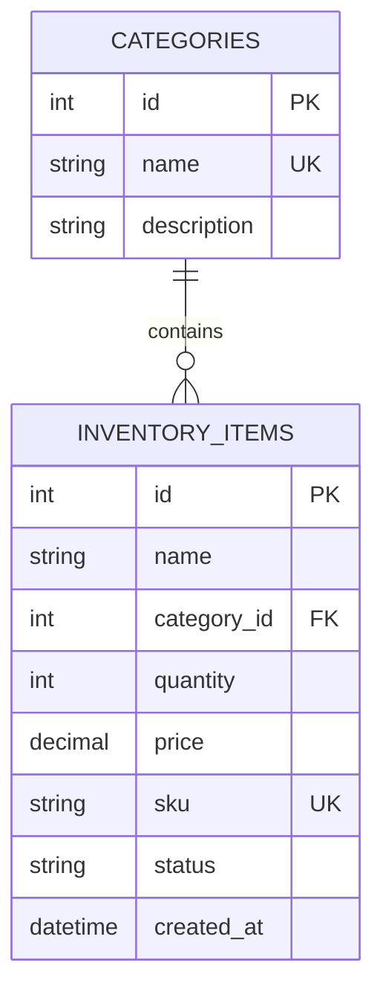

# Inventory Management System — Submission Notes

## 1. Project structure
```
├── backend/
│   ├── main.py          # FastAPI app with all endpoints
│   ├── requirements.txt
│   └── .env             # DATABASE_URL (Supabase)
├── frontend/
│   ├── src/
│   │   ├── App.jsx      # React UI with full CRUD
│   │   ├── main.jsx
│   │   └── styles.css   # Dark theme, responsive layout
│   ├── index.html
│   └── vite.config.js   # Proxy /api → backend:8000
├── sql/
│   └── schema.sql       # Tables: categories, inventory_items
└── docs/
    └── SUBMISSION.md
```

## 2. Features implemented
- **Category management** — create, read, update, delete categories
- **Item management** — full CRUD with category linking, SKU, quantity, price, status
- **Search** — filter items by name or SKU (`?q=`)
- **Category filter** — filter items by category
- **Stats dashboard** — total units, categories, stock value
- **Status badges** — In Stock / Low Stock / Out of Stock with color coding
- **Toast notifications** — success and error feedback
- **Confirm dialogs** — before delete operations
- **Loading states** — spinner while fetching
- **Error handling** — displays error if backend unreachable
- **Responsive layout** — works on mobile and desktop

## 3. API endpoints
| Method | Endpoint | Description |
|--------|----------|-------------|
| GET | /api/health | Health check |
| GET | /api/stats | Dashboard stats |
| GET | /api/categories | List all categories |
| POST | /api/categories | Create category |
| PUT | /api/categories/{id} | Update category |
| DELETE | /api/categories/{id} | Delete category |
| GET | /api/items | List items (supports ?q= and ?category_id=) |
| POST | /api/items | Create item |
| PUT | /api/items/{id} | Update item |
| DELETE | /api/items/{id} | Delete item |

## 4. Database design


## 5. Tech stack
- **Frontend**: React 18, Vite, Axios
- **Backend**: FastAPI, SQLAlchemy 2, Pydantic v2, Uvicorn
- **Database**: PostgreSQL (Supabase) — Tokyo region
- **ORM driver**: psycopg3 (psycopg[binary])

## 6. Running the project
```bash
# Backend
cd backend
..\.venv311\Scripts\python.exe -m uvicorn main:app --host 127.0.0.1 --port 8000

# Frontend (separate terminal)
cd frontend
npm run dev
```
- Swagger UI: http://127.0.0.1:8000/docs
- Frontend: http://localhost:3000

## 7. Test results
All 21 API tests passed:
- Health check ✅
- Create / list / update / delete categories ✅
- Duplicate category → 400 ✅
- Create / list / update / delete items ✅
- Duplicate SKU → 400 ✅
- Search by name and SKU ✅
- Filter by category ✅
- 404 on non-existent resources ✅

## 8. Submission checklist
- [x] React frontend implemented with full CRUD UI
- [x] FastAPI backend with all REST endpoints
- [x] SQL schema created in Supabase
- [x] DATABASE_URL configured and connected
- [x] All 21 API tests passing
- [x] Swagger UI available at /docs
- [x] Responsive design
- [x] Error handling and loading states
